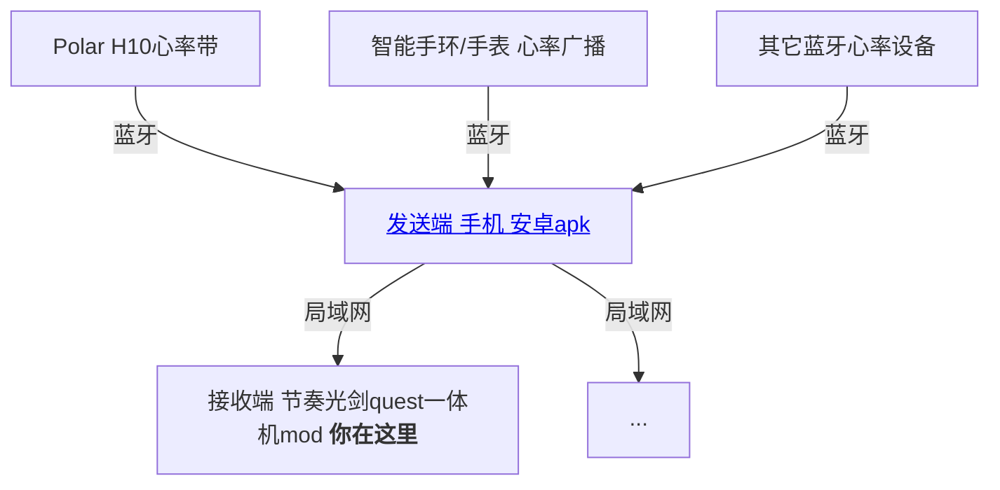

# 心率LAN接收端 - Quest一体机（BeatSaber模组）
这是一个可以在quest上查看心率的节奏光剑模组，[下载apk](https://github.com/frto027/HeartbeatLanServer/releases/latest)后，可以显示手机上的蓝牙心率设备。

1. 在手机上安装[这个](https://github.com/frto027/HeartbeatLanServer/releases/latest)软件，事先配对好蓝牙心率设备。打开并选择需要发送数据的蓝牙设备。
2. 在quest上安装[这个mod](https://github.com/frto027/HeartBeatLanClientBSQuest/releases/latest)（通过BMBF或者QuestPatcher软件）。
3. 打开游戏，只要手机和quest在一个局域网内，左上角会显示心率。
4. (可选)左侧有设置菜单可以配置。如果局域网内由多个人都在用这个软件，可以在游戏中过滤一下服务或者心率设备。

# 作者信息

本模组由frto027制作，基于的模板等组件信息详见[Readme](README.md)。
