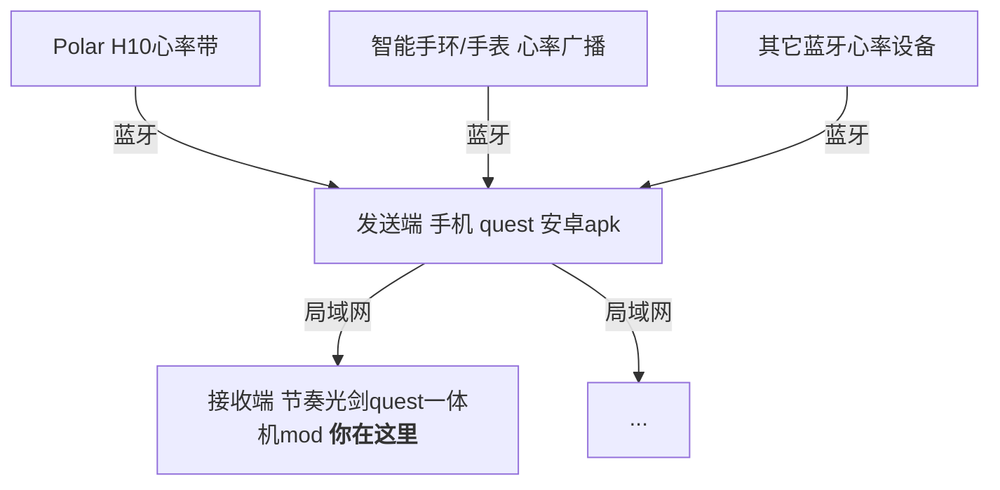

# 心率LAN接收端 - Quest一体机（BeatSaber模组）
这是一个可以在quest上查看心率的节奏光剑模组，[下载apk](https://github.com/frto027/HeartbeatLanServer/releases/latest)后，可以显示手机上的蓝牙心率设备。

1. 在quest上安装[这个](https://github.com/frto027/HeartbeatLanServer/releases/latest/download/heartbeatlan.apk)软件（通过sidequest或者adb），事先让quest配对好蓝牙心率设备（手环/手表需要打开心率广播的蓝牙，而不是配对手环本身的蓝牙）。打开app并选择需要发送数据的蓝牙设备。如果不想让心率设备连接quest，就在安卓手机上装这个软件，然后让手机和quest在一个局域网内。
2. 在quest上安装[这个光剑mod](https://github.com/frto027/HeartBeatLanClientBSQuest/releases/latest/download/HeartBeatLanReceiver.qmod)（通过BMBF或者QuestPatcher软件）。
3. 打开游戏，左上角会显示心率。如果是在手机上装的apk，需要手机和quest在同一个局域网。
4. (可选)左侧有设置菜单可以配置。如果局域网内由多台手机都在用这个软件，可以在游戏中过滤一下发送端或者心率设备。

支持游戏版本：1.28.0_4124311467

# 作者信息

本模组由frto027制作，基于的模板等组件信息详见[Readme](README.md)。
