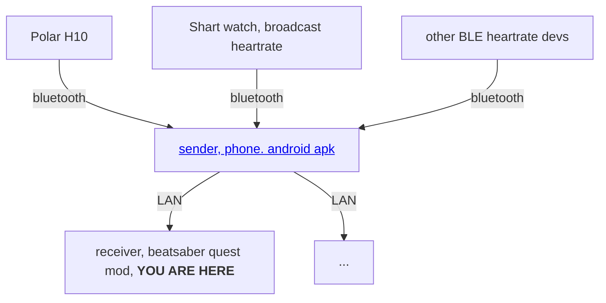

# HeartBeatLanReceiver - Quest (BeatSaber mod)

[中文说明](README.cn.md)

view your heartbeat inside the quest game

1. Install [this](https://github.com/frto027/HeartbeatLanServer/releases/latest) apk on your android phone. Open and select the Bluetooth heartrate devs.
2. Install [this](https://github.com/frto027/HeartBeatLanClientBSQuest/releases/latest) mod on your quest(via BMBF or QuestPatcher).
3. Open the beatsaber game. If your quest and phone in the same network, the heartrate will display.
4. (Optional) configure the devices via the config menu inside the game at left side. If there is more than one phones using the app, you can filter out the server or devices that you want to use.

# Dev.

Use `qpm-rust s build` to build
Same goes for `qpm-rust s copy` and `qpm-rust s qmod`

TODO:
- Clean up the network thread when game close? If the game's process exits normally, I think it's no need to do this.

## Credits

This mod is created by frto027.

* [zoller27osu](https://github.com/zoller27osu), [Sc2ad](https://github.com/Sc2ad) and [jakibaki](https://github.com/jakibaki) - [beatsaber-hook](https://github.com/sc2ad/beatsaber-hook)
* [raftario](https://github.com/raftario)
* [Lauriethefish](https://github.com/Lauriethefish), [danrouse](https://github.com/danrouse) and [Bobby Shmurner](https://github.com/BobbyShmurner) for [this template](https://github.com/Lauriethefish/quest-mod-template)
