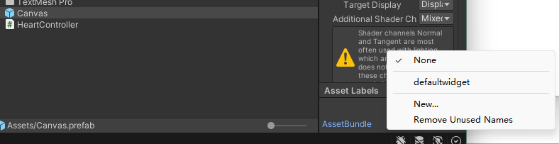

# UI Customize Guide (TL;DR)

1. Open the `UnityUI/Scenes/SampleScene.unity` with `Unity 2021.3.16f1`, both PC and Android build should supported, and run the scene, you will see how default UI works.
2. Edit the `Assets/DefaultWidget/DefaultWidget.prefab`. (btw. the color information is inside the `Assets/DefaultWidget/FlashAnim`)
3. click `Assets > Build AssetBundles`, two files were generated. `AssetBundles/defaultwidget` is only for PC to preview, and `AssetBundlesAndroid/defaultwidget` is for quest use.
4. copy the `AssetBundlesAndroid/defaultwidget` and rename it to your quest folder `/sdcard/ModData/com.beatgames.beatsaber/Mods/HeartBeatQuest/UI/<somename>.bundle`

# How it works

The quest mod uses the prefab just as `HeartController.cs`. code says everything, read it if you need.

And with the following additional behavior:

- When loading asset bundle, every asset inside it will be scanned. And the game will only uses a prefab if it found a `name:xxxx` below `info` gameobject.
- All TMP_Text fonts were replaced to the game fonts. If we don't do this, the font will invisible.
- The mod will find all Animator inside the prefab. If found, the parameters will be set when data come.
- if a gameobject called `auto:heartrate` is found, their texts will be replaced to heart rate when data come.
- All gameobject name below `info` is used to record your information. The `name` will display in the mod menu. The `root` will indicate where your ui is been mounted.

Avaliable `root` value:

-`energyPanelGo`
-`songProgressPanelGO`
-`relativeScoreGo`
-`immediateRankGo`

Animate Parameters:

- `datacome`, trigger, triggered when heart rate date come
- `heartrate`, integer, the heartrate
- `heartpercent`, float, the value of `heartrate/maxheart`, it maybe larger than 1 if possible, you can use this to display heart zone informations.

If you want another prefab, remember to change the AssetBundle options below.

# About the Default Widget

I will describe how did I make the default prefab here, to make sure you missed nothing.

You can start with a empty unity 3d project.

SampleScene is used to preview, it has a RootCanvas, and a Image called `energyGo` to simulate the game UI at the bottom. And energyGo added a `HeartController.cs` to simulate the mod does.

 When UI loaded, our ui will attach to the energyGO as the parent, so just create a canvas below the energyGO and change it `RectTransform` to makesure it's at the right place.

We can create a TextMeshPro text here to display the heartrate.

The mod will search all `GameObject`, if they called `auto:heartrate`, it's content will be replaced to number. So rename it.

You can't change the Font, because the mod will reset the TMPs font to the game used fond. If the mod not reset the font, all texts will be invisible for some reason idk. But you can use the font called `Teko-Medium SDF` to preview the effect in game, it's not a perfect preview, but can be used to design the text size .

The mod will find every Animator in the prefab and control them. Do this with your Unity skills, we won't go into detail since this isn't a Unity tutorial.

We could add more informathion to the scene. Create a empty GameObject called info. Disable it because we don't want it being rendered in the scene.

You can add more information to the UI.

The name is required, because the mod needs to display a name in the setthings UI. Please prevent duplicate name with other UI.

Drag and drop the canvas to the assets, we got a prefab called Canvas.

Change the AssetBundle option to make sure it will be packed to the output.

You can set multiple prefabs to a same AssetBundle value, and they will be packed to a single file.

Then use `Assets > Build AssetBundles` to export the asset bundle. Remember to add a suffix `.bundle`, the game will filter other files.